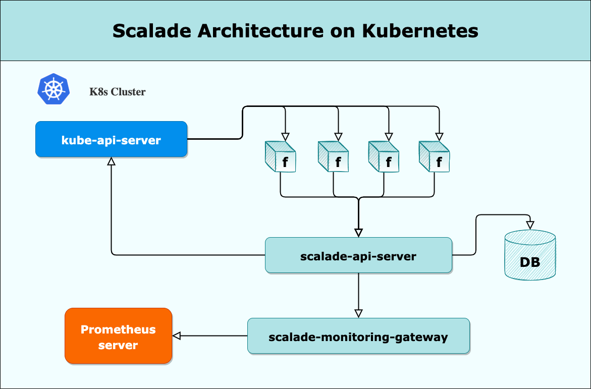

# Scalade API Server
Scalade API Server is the core component of **Scalade services**, is the backend service that exposes the Scalade API web service which is the responsible of the interaction between all the rest of the components. It is build with all build with Python-Django.

## About Scalade
Scalade is an orchestration/automation PaaS built to run into a Kubernetes cluster.
It provides a simple interface to build Functions that will run as Jobs on a k8s cluster.

## Brief brushstroke of the Scalade Architecture
Scalade runs on Kubernetes and it's fully templated with **Helm**, so you can have a full Scalade environment in just a few minutes.

Here is a simple diagram that illustrates how Scalade works:

  

     
    
     
  

 
<!--  -->

As you can see in the diagram Scalade is composed of the following components or services:
- **scalade-api-server**: the scalade API service, it's integrated with the **kube-api-server**.
- **functions**: are workloads that runs as Jobs, built with ScaladeSDKs. 
- **scalade-monitoring-gateway**: monitoring gateway service that comunicates with APM server(Prometheus).

Go further and check the full [documentation](https://scalade.io/scalade-docs-doesnt-exit-yet). 

## Installation
TODO

### Packages
TODO

## Tests
TODO

## Contribution guildeline
TODO
### Contributors
* Guillem Lopez Garcia